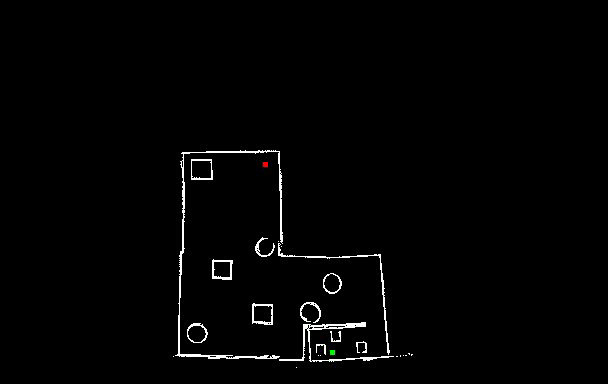
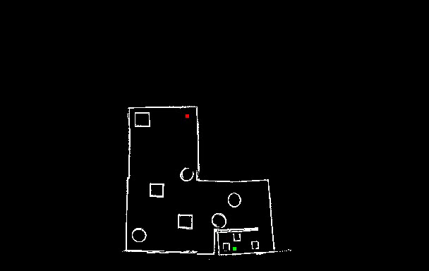

# Path planner

Deliverable is a ROS package, that is capable of constructing a route from point A to point B, avoiding obstacles from the map.

 
The path-planner uses a [PRM](https://en.wikipedia.org/wiki/Probabilistic_roadmap).

 
Results of the PRM can be exported to a video/gif or can  be vizualized on RVIZ

 

 

## Input / Output

- /start - start position of the route, geometry_msgs/PoseStamped
- /end - end position of the route, geometry_msgs/PoseStamped
- /path - found path, nav_msgs/Path.
- /path_vizualization - found path in map's frame (for rviz vizualization), nav_msgs/Path.

## Galery

### Path-planning with 500 points

 

 

### Path-planning with 20000 points

 

